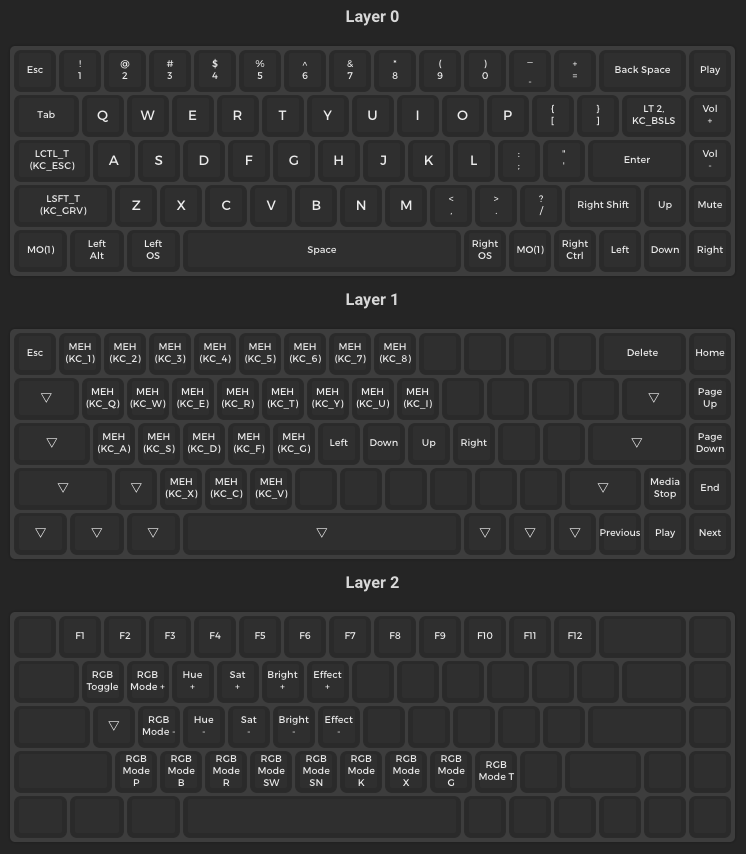

## QMK Configerator

1. Visit [QMK Configurator](https://config.qmk.fm/#/dztech/dz65rgb/v3/LAYOUT_65_ansi) and upload the json file from the repo.
2. Reconfigure the keys.
3. Download the json file and move it to the repo.
4. Download the bin file and move it to the repo.

## QMK Toolbox

https://github.com/qmk/qmk_toolbox/releases

1. Open the bin file in QMK Toolbox
2. Unplug the keyboard, hold Esc key while plugging back in to put into bootloader mode.
3. Flash
4. Unplug the keyboard and plug it back in.

